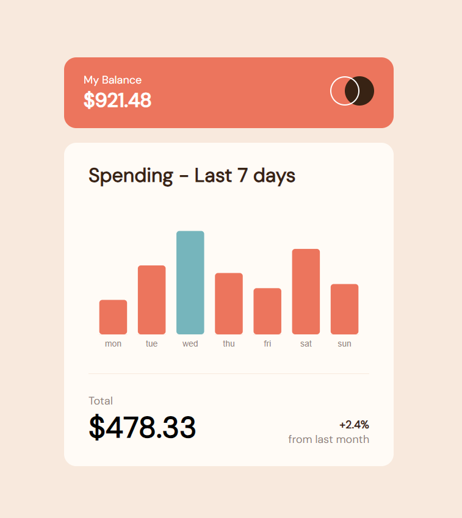

# Frontend Mentor - Expenses chart component solution
## Introduction
The Expenses chart component is build using plain vanilla JS and d3 charts. Its packed using ParcelJS 

### Screenshot

### Links
- Live Site URL: [Expense chart component](https://expensed3chartcomponent.netlify.app/)